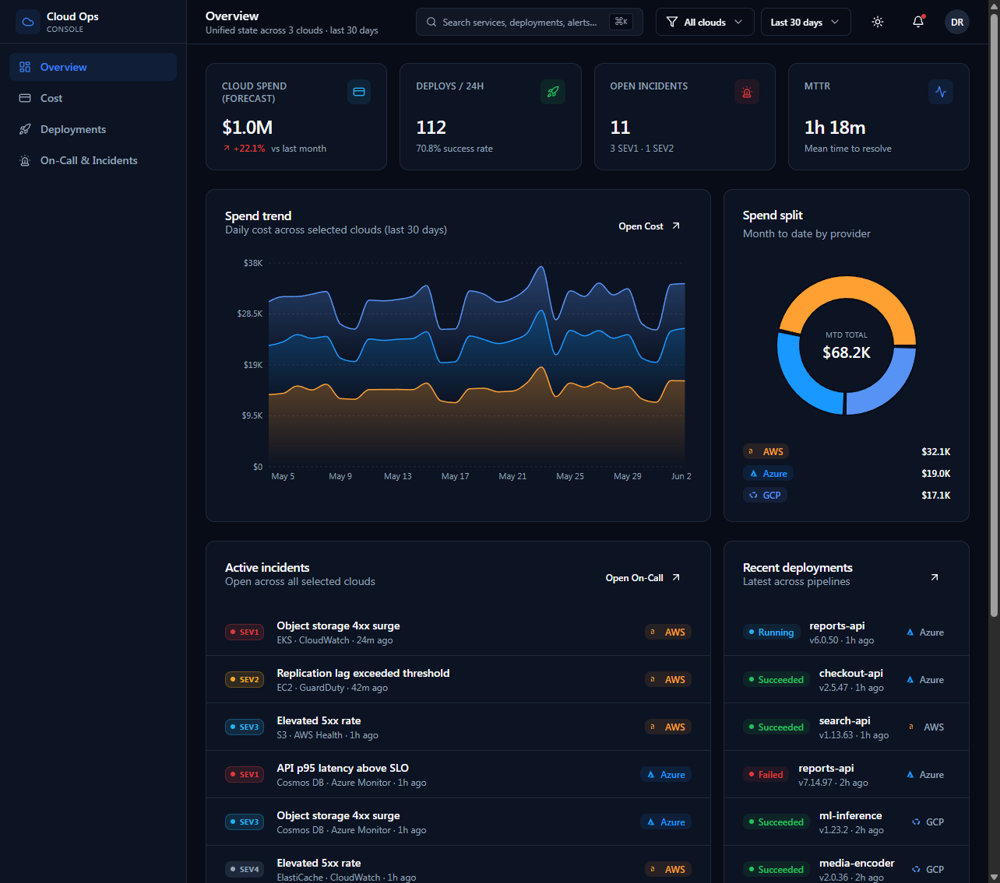
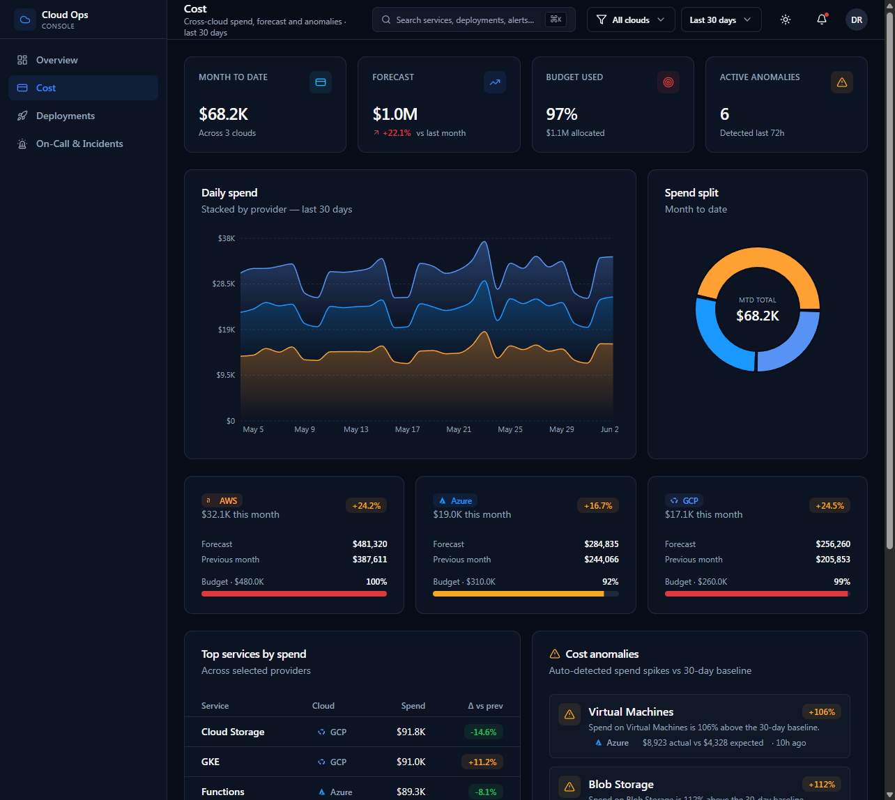
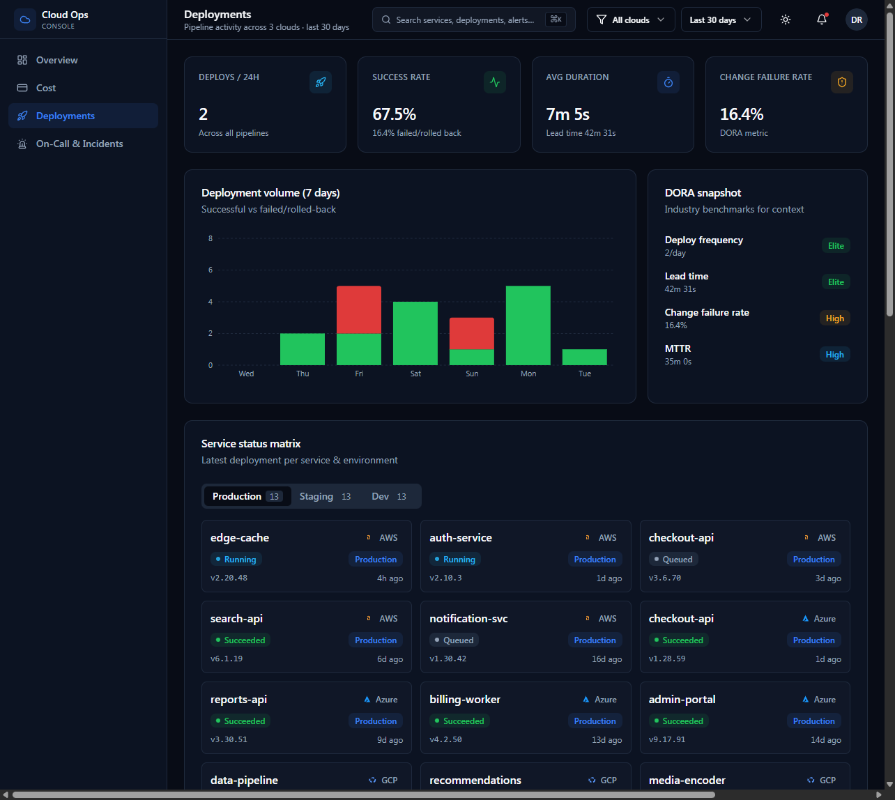
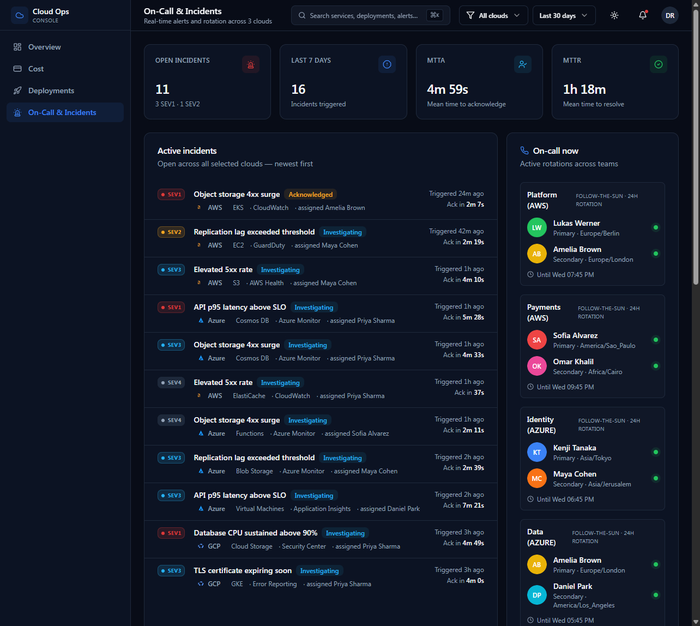

# Cloud Ops Console

Internal full-stack platform that **unifies cloud cost, deployment status and on-call signals
across AWS, Azure and GCP** — replacing five separate dashboards with one source of truth.


## Screenshots

### Overview — unified state across all three clouds



### Cost — spend, forecast, budget burn and anomaly detection



### Deployments — DORA metrics and service × environment matrix



### On-Call & Incidents — active alerts, severity, rotation schedule



## What it gives you

- **Overview** — single glance at spend, deploys and incidents across all three clouds.
- **Cost** — daily trend, MTD vs forecast, budget burn, top services, anomaly detection.
- **Deployments** — DORA metrics, 7-day volume, service × environment status matrix, recent deploys feed.
- **On-Call & Incidents** — active alerts grouped by severity, rotation schedule, MTTA/MTTR.
- **Provider filter** in the header — narrow any view to AWS/Azure/GCP or any combination.
- **Light / dark theme**, sticky header, keyboard-friendly.

## Architecture

```
app/
  (dashboard)/        ← server-rendered pages (Overview, Cost, Deployments, OnCall)
  api/                ← REST routes (cost, deployments, incidents, overview)
components/
  ui/                 ← shadcn-style primitives (Button, Card, Tabs, ...)
  charts/             ← recharts wrappers
  layout/             ← Sidebar, Header, CloudFilter, ThemeToggle
  shared/             ← MetricCard, CloudBadge, status pills, provider logos
lib/
  types.ts            ← domain types (Cost, Deployment, Incident, OnCall, Overview)
  providers/
    types.ts          ← CloudProvider interface
    mock/             ← deterministic mock implementation (default)
    aws.ts            ← real AWS adapter (stub with TODO + SDK pointers)
    azure.ts          ← real Azure adapter (stub)
    gcp.ts            ← real GCP adapter (stub)
    registry.ts       ← provider registry + cross-cloud aggregation
```

### The CloudProvider pattern

Every cloud is hidden behind one tiny interface:

```ts
interface CloudProvider {
  readonly id: ProviderId;
  getCost(rangeDays: number): Promise<CostReport>;
  getDeployments(rangeDays: number): Promise<DeploymentReport>;
  getIncidents(rangeDays: number): Promise<IncidentReport>;
}
```

The dashboard never imports an SDK directly — it asks the registry, which fans out the call
to each selected provider in parallel and merges results into a single shape.

To plug a real cloud in, replace `createMockProvider("aws")` inside `lib/providers/aws.ts`
with calls to:

| Cloud | Cost | Deployments | Incidents |
|-------|------|-------------|-----------|
| AWS   | `@aws-sdk/client-cost-explorer` `GetCostAndUsageCommand` | `@aws-sdk/client-codepipeline` `ListPipelineExecutions` | `@aws-sdk/client-cloudwatch` `DescribeAlarms` |
| Azure | `@azure/arm-costmanagement` `query.usage` | `azure-devops-node-api` builds/releases | `@azure/arm-monitor` activeAlerts |
| GCP   | `@google-cloud/billing` (or BigQuery billing export) | `@google-cloud/cloudbuild` `listBuilds` | `@google-cloud/monitoring` `listIncidents` |

Each adapter file already documents the exact SDK call sites in comments.

## Getting started

```bash
npm install
npm run dev
# open http://localhost:3000
```

The app starts with the **mock provider** by default, so the whole dashboard works
end-to-end with realistic data and zero credentials. Set `DATA_SOURCE=live` in `.env.local`
once you wire real adapters.

```bash
cp .env.example .env.local
```

## Scripts

- `npm run dev` — Next dev server
- `npm run build` — production build
- `npm run start` — run production build
- `npm run lint` — Next/ESLint
- `npm run typecheck` — `tsc --noEmit`

## Stack

- **Next.js 15** (App Router, RSC) + **React 19** + **TypeScript 5**
- **Tailwind CSS 3** + **shadcn-style** primitives on **Radix UI**
- **Recharts** for visualisations
- **next-themes** for dark/light mode
- **date-fns**, **lucide-react**, **zod**

## URL state

All dashboards are server components driven by URL search params, so views are shareable:

- `?providers=aws,gcp` — restrict to specific clouds
- `?range=7d|30d|90d` — change time range

## Status

MVP is complete:

- [x] Mock provider with realistic, deterministic seeded data per cloud
- [x] Aggregation registry (parallel fan-out + merge)
- [x] Overview / Cost / Deployments / On-Call dashboards
- [x] REST API at `/api/{overview,cost,deployments,incidents}`
- [x] Provider filter, time range filter, dark mode
- [ ] Wire real AWS adapter (TODO in `lib/providers/aws.ts`)
- [ ] Wire real Azure adapter
- [ ] Wire real GCP adapter
- [ ] Auth (SSO / OIDC)
- [ ] Persist user preferences
